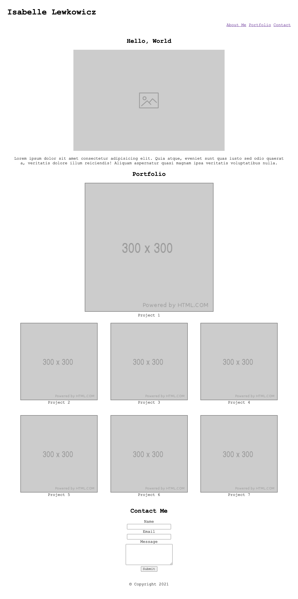

Deployed URL: https://isabellelew.github.io/Portfolio/

For this project I created a portfolio page. It contains a header, 3 main sections, and a footer. The header consists of my name, which doubles as a home button, as well as a navigation bar that contains links to each main section of the page. The first main section is a placeholder photo and bio. The second main section is the portfolio, which includes placeholder images and working links to Google (since I am still building my portfolio). The third section is a contact me form. The page finishes with a footer. As the screen size gets smaller, the background color of the site changes and the navigation bar list items stack. 

